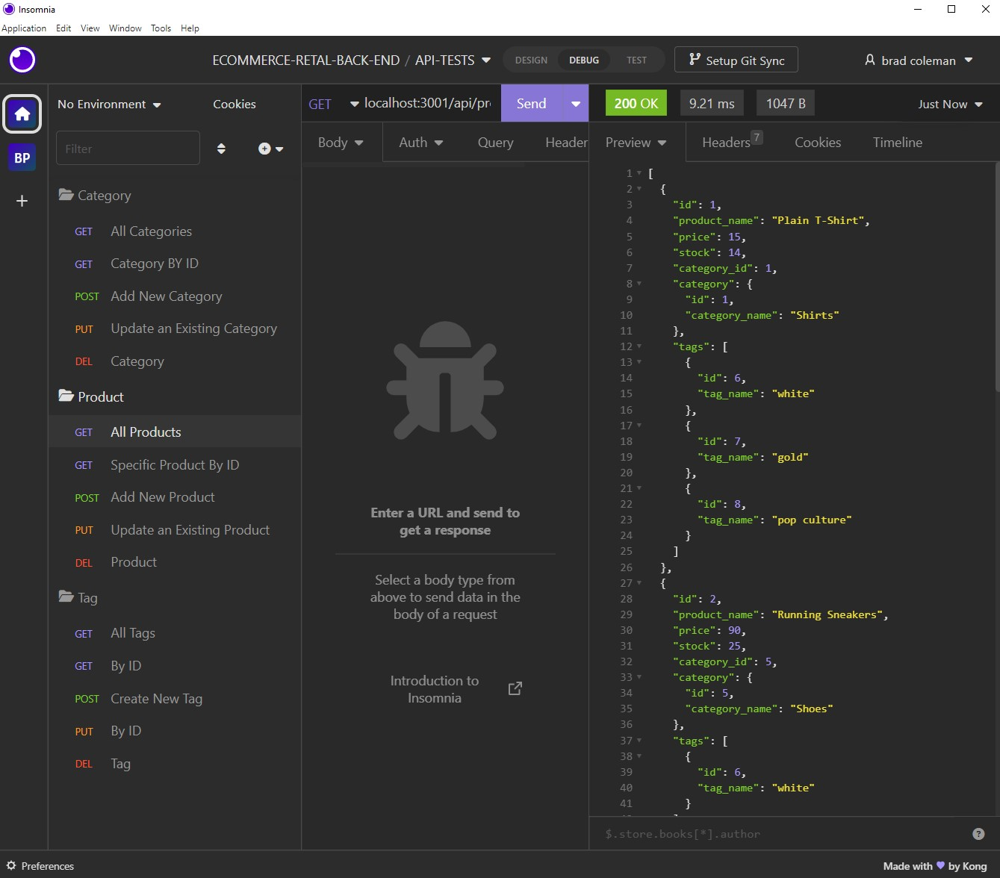

# E-commerce Back End 

# **Table of Contents**
1. [Description](#description)
2. [Testing](#testing)
3. [Technology Used and Credits](#technology-used-and-credits)
4. [About the Author](#about-the-author)
5. [License](#license)


# **Description**

The goal of this project was to create the back end of an E-commerce site. This was created using Express.js API and Sequelize to interact with a MySQL database.

Below is a screen shot of the set up in Insomnia.  I organized my tests in folders for the various endpoints (Product, Category and Tag)




Link to Demonstration Video of how this API and MySQL database ork:

https://app.vidcast.io/share/14cd5cce-9017-4180-a1ea-2c61a45084b3


# **Highlighted Code Example**

The following is code that I created that I would like to highlight.  

In this first block I created the associations (relationships) between the Category and Product tables.  Categories can have many products.  By invoking Product belongsTo Category it ensures that a product can have only one category.  The last two associations interact with the Product_tag table (which is considered a JOIN table).  A product and have many tags and tags can be applied to many products.  
```
// Categories have many Products AND Products belongsTo Category

Category.hasMany(Product, {
  foreignKey:'category_id'
})

Product.belongsTo(Category,{
  foreignKey: 'category_id'
})

// Products belongToMany Tags (through ProductTag)

Product.belongsToMany(Tag,{
  through: 'product_tag'
})

// Tags belongToMany Products (through ProductTag)

Tag.belongsToMany(Product, { 
  through: 'product_tag'
});

```

The following is an example of an API endpoint call to fetch the data in the Product table.  I originally observed that the when including model: Category and model: Tag, that the fields and data from the Product_tag table (ie the JOIN table) were also included in the output.  This is the default when using the include option with a "belongsToMany" association.  To change this default treatment I included the "through: {attributes: []}" code below. 

```
// get all products
router.get("/", async (req, res) => {
  // find all products
  const allProductData = await Product.findAll({
    /*To include the Category and Tag information - Note: Setting through:{attributes: to []} 
    overrides sequelize default to include the fields of the join table, in this instance 
    the Product_tag table.*/
    include: [{ model: Category }, { model: Tag, through: { attributes: [] } }],
  });
  return res.json(allProductData);
});
```

# **Testing** 

To test to ensure the code rendered the desired output I iterated a series of tests to ensure that all acceptance criteria were met and documented completion below:

| User Acceptance Criteria | Test Result | 
| ------------- |:-------------| 
|1. WHEN I add my database name, MySQL username, and MySQL password to an environment variable file THEN I am able to connect to a database using Sequelize  |**Completed**.  I can connect to the database using Sequelize  |
|2. WHEN I enter schema and seed commands THEN a development database is created and is seeded with test data   |**Completed**.  The schema can be loaded and the data seeded into the respective tables.  I performed a initialization and seeding three times.      |
|3. WHEN I enter the command to invoke the application THEN my server is started and the Sequelize models are synced to the MySQL database     |**Completed**.  When I use the "node server.js command the Sequelized models are synced to the MySql database      |
|4. WHEN I open API GET routes in Insomnia for categories, products, or tags THEN the data for each of these routes is displayed in a formatted JSON  |**Completed**.  I created three folders for the Category, Product and Tag models.  I used GET to obtain both "all" and "by id" products, categories and tags   |
|5. WHEN I test API POST, PUT, and DELETE routes in Insomnia THEN I am able to successfully create, update, and delete data in my database  |**Completed**.  When I add, update or delete a product, category or tag, the database is updated accordingly.       |


# **Technology Used and Credits**

I used many useful references in completing this project including the following.  In particular, I found the layout of the w3schools reference materials to be extremely intuitive and helpful.  They even have a "try me" feature where elements of code can be reviewed and tested. 


| Technology Used | Resource URL | 
| ------------- |:-------------| 
|  | [https://git-scm.com/](https://git-scm.com/) | 
|  | [https://developer.mozilla.org/en-US/docs/Learn/JavaScript](https://developer.mozilla.org/en-US/docs/Learn/JavaScript) |
|  | [https://nodejs.org/en/](https://nodejs.org/en/) |
|  | [https://dev.mysql.com/doc/refman/8.0/en/](https://dev.mysql.com/doc/refman/8.0/en/) |
|  | [https://sequelize.org/](https://sequelize.org/) |

# **About the Author**

My name is Brad Coleman. I am fairly new to web development but have considered it a hobby for several years and have hacked my way through learning various aspects including php, html and mysql.  I am currently enrolled in the Cal Berkeley Extension Web Development Boot camp and am excited to learn web development more holistically.  I have spent my earlier career working as a corporate controller / CPA.

- [Linkedin Profile](https://www.linkedin.com/in/brad-coleman-109529/)
- [GitHub Repos](https://github.com/bradcoleman60?tab=repositories)


# **License**

MIT License

Copyright (c) 2022 Brad Coleman

Permission is hereby granted, free of charge, to any person obtaining a copy
of this software and associated documentation files (the "Software"), to deal
in the Software without restriction, including without limitation the rights
to use, copy, modify, merge, publish, distribute, sublicense, and/or sell
copies of the Software, and to permit persons to whom the Software is
furnished to do so, subject to the following conditions:

The above copyright notice and this permission notice shall be included in all
copies or substantial portions of the Software.

THE SOFTWARE IS PROVIDED "AS IS", WITHOUT WARRANTY OF ANY KIND, EXPRESS OR
IMPLIED, INCLUDING BUT NOT LIMITED TO THE WARRANTIES OF MERCHANTABILITY,
FITNESS FOR A PARTICULAR PURPOSE AND NONINFRINGEMENT. IN NO EVENT SHALL THE
AUTHORS OR COPYRIGHT HOLDERS BE LIABLE FOR ANY CLAIM, DAMAGES OR OTHER
LIABILITY, WHETHER IN AN ACTION OF CONTRACT, TORT OR OTHERWISE, ARISING FROM,
OUT OF OR IN CONNECTION WITH THE SOFTWARE OR THE USE OR OTHER DEALINGS IN THE
SOFTWARE.


